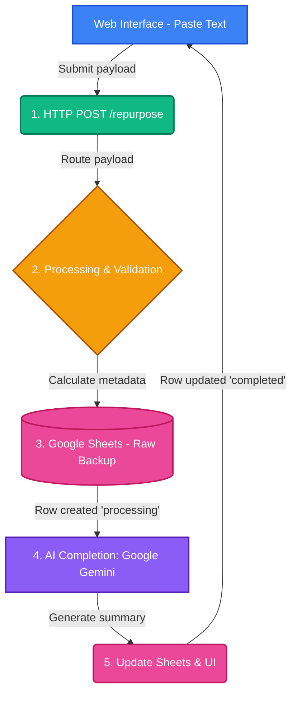

# SE 445 – HW1 & HW2: Social Content Repurposer

## 📋 Project Overview

This project satisfies both **Homework 1 (Component Foundations)** and **Homework 2 (Data Persistence)** for SE 445. It demonstrates a working automation pipeline using Python, FastAPI, Google Sheets API, and Google Gemini AI.

**Topic:** Social Content Repurposer  
**Goal:** Take long-form text pasted into a UI, back it up to Google Sheets securely, and use AI to generate a short, engaging social media summary.

---

## 🏗️ Workflow Architecture

Below is the diagram of our data pipeline, encompassing both HW1 triggers and HW2 data persistence.



---

## 📁 File Structure

| File | Purpose |
|---|---|
| `main.py` | Core application. Contains the FastAPI server, web interface, processing, Sheets API integration, and Gemini AI call. |
| `requirements.txt` | Python dependencies (FastAPI, gspread, google-generativeai, etc.) |
| `credentials.json` | Google Cloud service account key for Sheets manipulation (Git-ignored). |
| `.env` | Personal API keys and Google Sheet IDs (Git-ignored). |
| `outputs/` | Local backup directory for AI-generated text files. |
| `HW1_Report.md` | Formal report focusing on HW1 deliverables (Pipeline components). |
| `HW2_Report.md` | Formal report focusing on HW2 deliverables (Data persistence). |

---

## 🚀 How to Run

### 1. Prerequisites
- Python 3.10+
- Google Gemini API key
- Google Cloud Service Account (`credentials.json`)
- A Google Sheet shared with your service account email

### 2. Install Dependencies
```bash
pip install -r requirements.txt
```

### 3. Start the Server
```bash
python main.py
```
The server will automatically start at `http://localhost:8000`.

### 4. Test the Pipeline
1. Open `http://localhost:8000` in your web browser.
2. Paste any long-form text (like a blog post) into the UI box and click "Generate Summary".
3. Check your specified Google Sheet to see the raw text appended safely.
4. Wait a few seconds for the AI pipeline to finish and display the social media summary on the UI.

---

## 🔧 Technologies Used

- **Python & FastAPI** – Backend trigger and Web UI endpoint
- **Google Sheets API (gspread)** – Data Persistence (HW2)
- **Google Gemini API** – AI Text Generation
