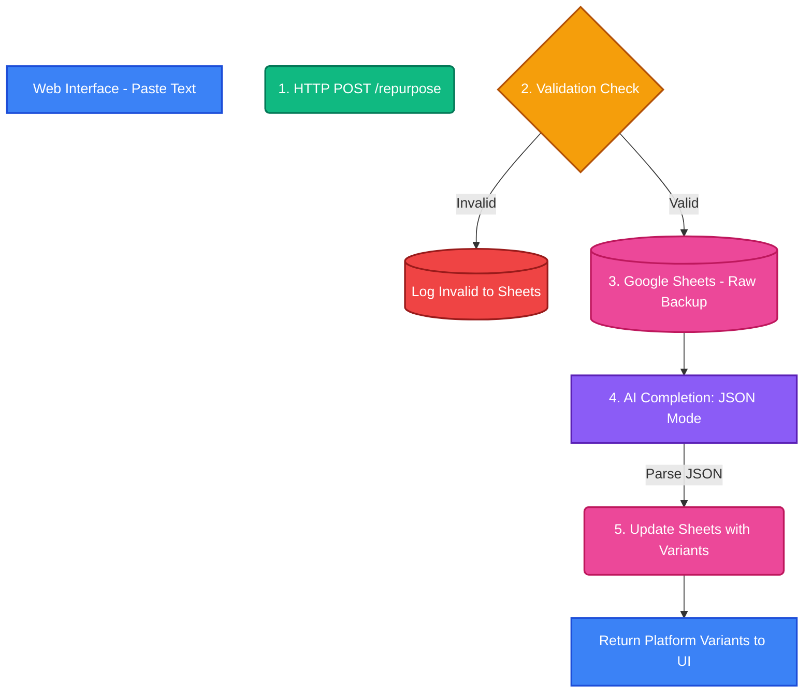

# SE 445 – HW1, HW2 & HW3: Social Content Repurposer

## 📋 Project Overview

This project satisfies **Homework 1 (Component Foundations)**, **Homework 2 (Data Persistence)**, and **Homework 3 (Data Validation & AI Categorization)** for SE 445. It demonstrates a working automation pipeline using Python, FastAPI, Google Sheets API, and Google Gemini AI.

**Topic:** Social Content Repurposer  
**Goal:** Take long-form text pasted into a UI, validate the inputs, back it up securely to Google Sheets, and use AI to generate platform-specific social media posts (Twitter, LinkedIn, Instagram) in a structured JSON format.

---

## ✨ Features by Homework

*   **HW1 (Component Foundations):** Frontend UI connected to a FastAPI backend endpoint (`POST /repurpose`). Basic AI integration.
*   **HW2 (Data Persistence):** Securely saving incoming raw text and processed results to Google Sheets using `gspread` and GCP Service Accounts.
*   **HW3 (Data Validation & Standardization):** 
    *   **Validation:** Checks if the email contains an `@` symbol and if the source text is at least 20 characters long. Invalid inputs are blocked (HTTP 400) and logged as "Invalid" in Google Sheets.
    *   **Standardization (JSON Mode):** The Gemini AI prompt is engineered to output a strict JSON object containing separate variants for `twitter_variant`, `linkedin_variant`, `instagram_variant`, and a `detected_tone`. These are parsed and saved into their respective columns in Google Sheets.

---

## 🏗️ Workflow Architecture

Below is the diagram of our data pipeline, encompassing HW1 triggers, HW2 data persistence, and HW3 validation/categorization logic.



---

## 📁 File Structure

| File | Purpose |
|---|---|
| `main.py` | Core application. Contains the FastAPI server, web interface, validation logic, Sheets API integration, and Gemini AI JSON parsing. |
| `requirements.txt` | Python dependencies (FastAPI, gspread, google-generativeai, etc.) |
| `credentials.json` | Google Cloud service account key for Sheets manipulation (Git-ignored). |
| `.env` | Personal API keys and Google Sheet IDs (Git-ignored). |
| `migrate_sheet.py` | Migration script used to update old Google Sheets to the new HW3 schema. |
| `README.md` | This documentation file. |

---

## 🚀 How to Run

### 1. Prerequisites
- Python 3.10+
- Google Gemini API key
- Google Cloud Service Account (`credentials.json`)
- A Google Sheet shared with your service account email

### 2. Install Dependencies
```bash
pip install -r requirements.txt
```

### 3. Start the Server
```bash
python main.py
```
The server will automatically start at `http://localhost:8000`.

### 4. Test the Pipeline
1. Open `http://localhost:8000` in your web browser.
2. Enter an email address and paste long-form text.
3. **Invalid Test:** Try entering an email without an `@` symbol or text shorter than 20 characters. You will see an error in the UI and an "Invalid" row in Google Sheets.
4. **Valid Test:** Enter valid data and click "Generate Summary".
5. Wait a few seconds. The UI will display 3 different social media platform variants (Twitter, LinkedIn, Instagram) and the detected tone.
6. Check your specified Google Sheet to see all JSON fields mapped to their own columns securely.

---

## 🔧 Technologies Used

- **Python & FastAPI** – Backend trigger and Web UI endpoint
- **Google Sheets API (gspread)** – Data Persistence (HW2)
- **Google Gemini API** – AI Text Generation in JSON Mode (HW3)
